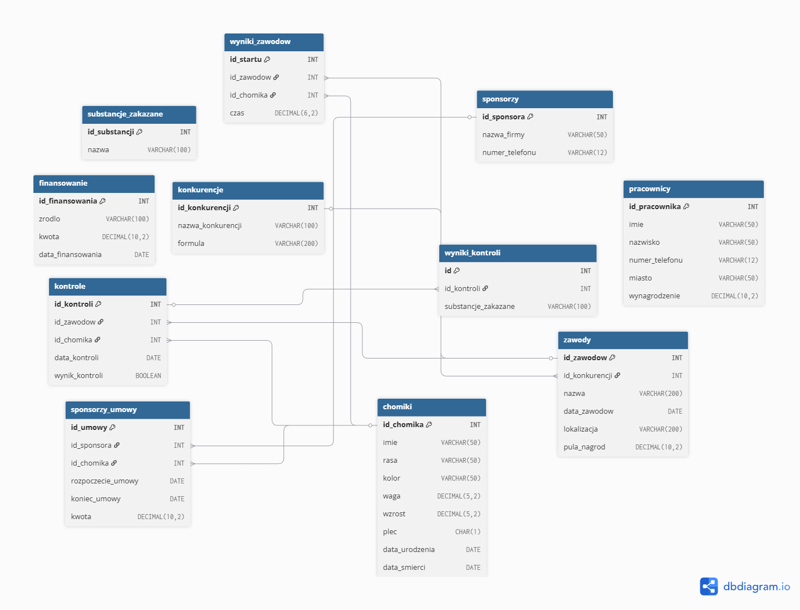

# Dokumentacja - Chomiki sportowe
## Wykorzystane technologie
1. **Język programowania** - Python 3.10 (generowanie danych)
2. **System bazy danych** - MySQL 8.0 (serwer zdalny)
3. **Biblioteki Python** :
* mysql-connector-python (łączność z bazą)
* numpy (rozkłady prawdopodobieństwa)
* pandas
* random (generowanie danych losowych)
* SQLAlchemy 
* Plotly
* PyMySQL
* IPython
4. **Narzędzia** :
* dbdiagram.io
* Quarto
* Jupyter
* Visual Studio Code (edytor kodu)
* SQLTools (klient bazy danych)
* GitHub (kontrola wersji)
## Lista plików i ich zawartość
1. **generate_tables.sql** - kod SQL definiujący tabele według określonego układu spełniającego warunki EKNF
2. FOLDER - **Dane/** - zawiera słowniki w formacie CSV :
* cities.csv
* first_names.csv
* company_names.csv
* illegal_substances.csv
* competition_names.csv
, które są później użytkowane w wypełnianiu tabel
3. **generatory.py** - główny plik projektu. Odpowiada za:
* łączenie z bazą danych
* czyszczenie/tworzenie tabel
* import danych ze słowników
* generowanie danych wypełniających tabele
4. **Raport.qmd** - plik generujący raport
5. **Raport.html** - raport zawierający pełną analizą danych zawartych w bazach
6. **dokumentacja.md** - plik źródłowy dokumentacji
7. **dokumentacja.pdf** - plik z dokumentacją projektu 
## Sposób uruchamiania
1. **Sklonowanie repozytorium z GitHub** - Należy pobrać kod źrodłowy na dysk lokalny z wykorzystaniem komendy:

`git clone`(znajdując się w docelowej lokalizacji)

2. **Instalacja bibliotek** - Korzystamy z poniższej komendy w celu pobrania bibliotek: 

`pip install mysql-connector-python numpy pandas`

3. **Weryfikacja danych serwera** - Sprawdzamy, czy dane dotyczące serwera w pliku **generatory.py** są poprawne.
4. **Uruchomienie generatora** - Uruchamiamy plik **generatory.py**. W ten sposób tabele zostaną przygotowane i dane wygenerowane.
5. **Wygenerowanie raportu** - Uruchamiamy plik Raport.qmd, który wygeneruje Raport z uaktualnionymi wykresami.
## Schemat projektu
Baza składa się z jedenastu powiązanych tabel. Są to:
1. **Główne obiekty**: chomiki, pracownicy, sponsorzy
2. **Wydarzenia**: zawody, konkurencje
3. **Finanse**: finansowanie, sponsorzy_umowy
4. **Wyniki i Kontrola**: wyniki_zawodów, kontrole, wyniki_kontroli, substancje_zakazane

## Zależności funkcyjne
Tabele funkcyjne postaci **F:X&rarr;Y**, gdzie **X&rarr;Y** oznacza: X(klucz) determinuje Y:
1. **Chomiki** - *id_chomika* &rarr; {imie, rasa, kolor, waga, wzrost, płeć, data urodzenia, data śmierci}
2. **finansowanie** - *id_finansowania* &rarr; {źródło, kwota, data_finansowania}
3. **konkurencje** - *id_konkurencji* &rarr; {nazwa_konkurencji, formuła}
4. **Kontrole**  - *id_kontroli* &rarr; {id_zawodów, id_chomika, data_kontroli, wynik_kontroli}
5. **pracownicy** - *id_pracownika* &rarr; {imię, nazwisko, numer_telefonu, miasto, wynagrodzenie}
6. **sponsorzy** - *id_sponsora* &rarr; {nazwa_firmy, numer_telefonu}
7. **Sponsorzy_umowy** - *id_umowy* &rarr; {id_sponsora, id_chomika, rozpoczecie_umowy, koniec_umowy, kwota}
8. **Substancje_zakazane** - *id_substancji* &rarr; {nazwa}
9. **wyniki_kontroli** - *id* &rarr; {id_kontroli, substancje_zakazane}
10. **wyniki_zawodów** - *id_startu* &rarr; {id_zawodów, id_chomika, czas}
11. **zawody** -  *id_zawodów* &rarr; {id_konkurencji, nazwa, data_zawodow, lokalizacja, pula_nagród}
## Uzasadnienie EKNF

| id_chomika | imie | rasa | kolor | waga | wzrost | plec | data_urodzenia | data_smierci |
| :--- | :--- | :--- | :--- | :--- | :--- | :--- | :--- | :--- |
| 1 | lorraine | syryjski | miodowy | 63.32 | 7.72 | F | 2016-11-06 | 2018-02-22 |
| 2 | royce | mongolski | popielaty | 34.55 | 6.99 | M | 1992-06-17 | 1994-12-01 |
| 3 | atsuko | chinski | czekoladowy | 56.21 | 6.28 | M | 2009-10-10 | 2012-08-13 |
| 4 | graeme | gansu | miodowy | 52.66 | 7.11 | F | 2021-03-12 | 2023-06-09 |
| ... | ... | ... | ... | ... | ... | ... | ... | ... |

1. **Mamy spełnione 1NF**, ponieważ:
* Dane są atomowe (w jednym polu, tylko jedna informacja)
* Istnieje klucz główny

Dobrze widać na przykładzie funkcji z punktu 5.

2. **Mamy spełnione 2NF**, ponieważ:
* Spełnione jest 1NF
* każdy atrybut niekluczowy jest w pełni funkcyjnie zależny od całęgo klucza głównego.(brak częściowej zależności)

W naszym przypadku dla każdej tabeli klucz jest pojedynczy, więc 2NF jest automatycznie spełnione

3. **Mamy spełnione 3NF**, ponieważ:
* Spełnione jest 2NF
* Żaden atrybut niekluczowy nie jest zależny przechodnio od klucza głównego. To znaczy, że nie atrybut niekluczowy nie może zależeć od jakiegokolwiek innego atrybutu niekluczowego. (Nie zachodzi **X&rarr;Y&rarr;Z**)

W naszej tabeli widać, że każdy atrybut zależy tylko i wyłącznie od jedynego i pojedynczego klucza głównego.

4. **Mamy spełnione EKNF**, ponieważ:
* Spełnione jest 3NF
* Wszystkie zależności funkcyjne mają postać **F:X&rarr;A**, gdzie X jest superkluczem lub A jest elementarnym atrybutem kluczowym

W naszych bazach klucz główny zawsze jest superkluczem i jedyną kolumną determinującą jednoznacznie resztę kolumn.

## Najtrudniejsze elementy realizacji
To, co sprawiło nam nawjęcej prblemów w trakcie realizacji projektu, to:
* utrzymanie pełnej normalizacji bazy danych
* generowanie danych próbujących odzwierciedlać rzeczywiste uwarunkowania chomików